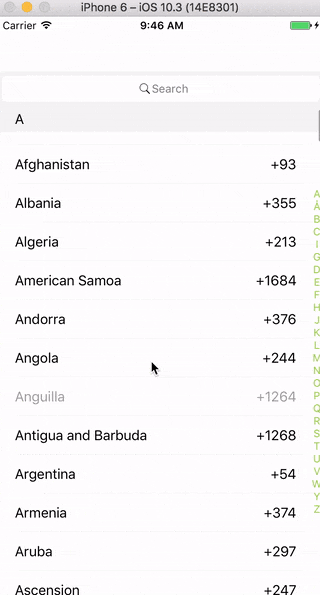

# ReactNativeCountryCodeList
Country code list with alphabet navigation
[](https://npmjs.org/package/react-native-country-code-list "View this project on npm")
[](https://npmjs.org/package/react-native-country-code-list "View this project on npm")

Country code list with alphabet navigation for Android/IOS to use with react-native,
based on `react-native-alphabetlistview`, also using `react-native-search-box`

## Installation
1. `npm install react-native-country-code-list --save` or
   `yarn add react-native-country-code-list`
   
## Demo



# Usage

```js

import CountryCodeList from 'react-native-country-code-list'

class CountryCodeListApp extends React.Component {
    render() {
      return (
        <CountryCodeList
	  onClickCell={(cellObject) => console.log(cellObject)}
	  />
      );
    }

```

## Props
All props are optional
### Note if you passing your custom data as list you must also provide renderCell, renderSectionHeader and renderSectionItem functions and search action.

| Prop  | Default  | Type | Description |
| :------------ |:---------------:| :---------------:| :-----|
| alphabetListProps | null | `object` | `react-native-alphabetlistview` props |
| searchProps | null | `object` | `react-native-search-box` props |
| onClickCell | () => {} | `func` | Callback onClick list item |
| headerBackground | rgb(245, 245, 245) | `any` | background for headers and search wrapper |
| cellHeight | 44.5 | `number` | Cell height |
| sectionHeaderHeight | 30 | `number` | Section header height |
| renderCell | null | `func` | Custom Cell component |
| renderSectionItem | null | `func` | Custom Section Item (Alphabet) component |
| renderSectionHeader | null | `func` | Custom Section header component |
| sectionHeaderStyle | null | `any` | style section header |
| sectionHeaderTextStyle | null | `any` | style section header text |
| sectionItemTextStyle | null | `any` | style section item text |
| cellStyle | null | `any` | style list item |
| cellTitleStyle | null | `any` | style list item title |
| cellLabelStyle | null | `any` | style list item right label|


## Questions or suggestions?

Feel free to [open an issue](https://github.com/ElekenAgency/ReactNativeCountryCodeList/issues)
